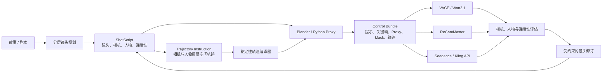

# VideoActAgent

VideoActAgent 是一个“先规划、再预演、后生成、最后评估修订”的视频生成 Agent。项目把故事编译成结构化的镜头与人物调度，通过 Blender/Python 生成可播放的低成本代理视频，再将代理、关键帧、轨迹和电影语言提示传给开源或云端视频生成模型。

项目重点是多镜头连续性、相机控制、人物走位，以及用统一控制协议比较不同生成后端；不重新训练完整的视频基础模型。

## 项目架构



### 1. ShotScript 镜头规划

规划层把故事拆成场景和镜头，并为每个镜头保存景别、焦距、相机起止位置、运镜类型、注视目标、人物起止位置、动作、朝向和跨镜头连续性。第一版使用单一分阶段 Planner，保留 MovieAgent 和 Camera Artist 的分层规划思想，同时控制多 Agent 协作复杂度。

### 2. Trajectory Instruction 轨迹控制层

轨迹层借鉴 ATI 的交互方式，让用户在预览画面上绘制相机圆轨迹、人物折线和静态锚点。轨迹保存为归一化、可校验、可哈希的 JSON，再由确定性编译器转成：

- ShotScript 相机与人物约束；
- 分时动作提示和电影语言提示；
- Blender 中可视化的曲线、控制点与关键帧；
- 面向 Kling/Seedance 的 `prompt_approximation`；
- 面向后续开源模型注入器的显式轨迹张量接口。

由于闭源 T2V API 不接收 ATI 的中间特征或逐帧轨迹张量，API 主线通过“轨迹 → 可执行预演 → 确定性提示编译 → 真实视频评估”实现后端无关控制；ATI/Wan 注入器保留为开源研究对照。

### 3. Blender/Python 可执行预演

受约束的场景模板把 ShotScript 与轨迹编译成低成本 3D 代理视频。Proxy 同时表达相机运动、构图、人物走位、动作时间线和轨迹控制点，让导演意图在调用生成模型前即可播放和修改。该层借鉴 SceneCraft 的“结构化场景 → 数值空间约束 → Blender 代码 → 渲染反馈”路径，并扩展到多镜头与人物调度。

### 4. 统一 Control Bundle

控制桥将每个镜头整理成统一输入包：

- 电影语言提示与分时动作提示；
- 首帧、尾帧和参考图；
- RGB proxy video；
- VACE 的 `src_video`、`src_mask`、`src_ref_images` 与 prompt；
- 轨迹指令、相机/人物约束、连续性约束和文件哈希。

同一镜头计划可在 VACE、ReCamMaster、Kling 与 Seedance 间复用，支持比较纯提示、关键帧、结构控制和相机重渲染。

### 5. 视频生成后端

- **VACE / Wan2.1 1.3B**：开源结构控制主线，接收 proxy、mask、参考图与文本条件。
- **ReCamMaster**：显式相机轨迹重渲染对照，用于研究输入视频内容保持与新视角生成。
- **Seedance / Kling**：云端 T2V 后端，用于测试电影语言提示与轨迹编译提示在闭源模型中的迁移效果。

### 6. 评估与闭环修订

评估层对齐请求轨迹与真实视频中的观测轨迹，并汇总相机背景运动、人物出现/走位、动作时序、构图和跨镜头屏幕方向。反馈只触发有限、可解释的修订，例如强化方向、拆分时间段、减小幅度、把环绕简化为横移，或保留已经匹配的控制。

## 核心数据流

```text
Story
  -> ShotScript
  -> Trajectory Instruction
  -> Blender Scene / Proxy
  -> Control Bundle
  -> Backend Job (VACE | ReCamMaster | Seedance | Kling)
  -> Generated Video
  -> Observed Trajectory / Camera Evaluation
  -> Bounded Revision
```

## 主要创新点

1. **可执行代理视频作为中间控制语言**：先生成可播放、可检查的 Blender proxy，再映射到不同视频模型。
2. **API 无关的轨迹指令层**：把画布轨迹编译为 ShotScript、分时提示、Proxy 和统一评估目标，同时兼容闭源 T2V 与后续开源注入器。
3. **相机与人物联合调度**：同一结构同时描述相机轨迹、人物轨迹、动作时间和连续性。
4. **多后端统一控制协议**：使用同一 Control Bundle 比较提示控制、VACE 结构输入和 ReCamMaster 相机轨迹。
5. **真实视频驱动的有限闭环**：通过可追溯的观测与指标选择固定修订操作，避免无限制地重写提示。

## 参考论文与开源基础

### Agent 与可执行场景规划

- Hu et al., [SceneCraft: An LLM Agent for Synthesizing 3D Scene as Blender Code](https://arxiv.org/abs/2403.01248), 2024。
- Wu et al., [Automated Movie Generation via Multi-Agent CoT Planning (MovieAgent)](https://arxiv.org/abs/2503.07314), 2025；[官方代码](https://github.com/showlab/MovieAgent)。
- Hu et al., [Camera Artist: A Multi-Agent Framework for Cinematic Language Storytelling Video Generation](https://arxiv.org/abs/2604.09195), 2026。

### 轨迹与相机控制

- Hou et al., [Training-free Camera Control for Video Generation (CamTrol)](https://arxiv.org/abs/2406.10126), ICLR 2025；[项目主页](https://lifedecoder.github.io/CamTrol/)。
- Bytedance, [ATI: Any Trajectory Instruction for Controllable Video Generation](https://arxiv.org/abs/2505.22944), 2025；[官方代码](https://github.com/bytedance/ATI)。
- Bai et al., [ReCamMaster: Camera-Controlled Generative Rendering from A Single Video](https://arxiv.org/abs/2503.11647), ICCV 2025；[官方代码](https://github.com/KlingAIResearch/ReCamMaster)。

### 视频生成与结构控制

- Jiang et al., [VACE: All-in-One Video Creation and Editing](https://arxiv.org/abs/2503.07598), ICCV 2025；[官方代码](https://github.com/ali-vilab/VACE)；[Wan2.1-VACE-1.3B](https://huggingface.co/Wan-AI/Wan2.1-VACE-1.3B)。
- Wan Team, [Wan: Open and Advanced Large-Scale Video Generative Models](https://arxiv.org/abs/2503.20314), 2025；[官方代码](https://github.com/Wan-Video/Wan2.1)。
