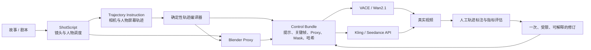

# VideoActAgent

VideoActAgent 是一个“先规划、再预演、后生成、最后评估修订”的视频生成 Agent。它先把故事编译成结构化镜头、相机轨迹和人物调度，用 Blender 生成可播放、可检查的低成本代理视频，再把同一控制意图映射到 VACE、Kling 或 Seedance 等后端。

项目不训练新的基础视频模型。当前创新集中在模型上层：把镜头语言、相机/人物联合轨迹、Blender 可执行预演、跨后端控制包、真实视频测量和有限修订连接为一条可追溯流水线。

## 架构



核心模块如下：

- `ShotScript`：保存景别、焦距、相机起止位姿、运镜类型、人物起止位置、动作和跨镜头连续性。
- `Trajectory Instruction`：采用 ATI 风格的归一化画布指令，支持相机圆轨迹、人物折线和静态锚点；JSON 可校验、可规范化、可哈希。
- `Trajectory Compiler`：把轨迹确定性地编译成 ShotScript 约束、分时动作提示、电影语言提示和后端能力声明；闭源 T2V 当前使用 `prompt_approximation`。
- `Blender Proxy`：真实启动 Blender，把相机与人物关键帧渲染成 `.blend`、MP4、检查帧和清单，不用占位视频替代验收。
- `Backend Gateway`：为 Kling、Seedance 准备不可变 bundle，并以零自动重试方式提交、查询和下载；每次运行保存请求、响应、状态和结果哈希。
- `VACE Adapter`：把 proxy、mask、参考帧和提示映射到 VACE/Wan2.1 输入；官方 VACE 与 ReCamMaster 源码使用固定 commit 审计。
- `Observer / Evaluator`：从真实 MP4 解码指定帧，保存人工点击或遮挡标记，计算方向、端点误差、到达时间和 DTW。
- `Bounded Revision`：最多生成一次修订，只允许固定、可解释的操作；正式实验矩阵在证据或 bundle 不完整时保持关闭。

代码、真实运行产物和阶段报告分别位于 `videoactagent/`、`runs/` 与 `docs/reports/`。模块输入输出说明见 `examples/module_io_manifest.json`，逐模块调试命令见 `docs/DEBUGGING.md`。

## 安装

要求 Python 3.10+。本地代理渲染需要 Blender；当前验证环境使用 Blender 5.1.2。

```powershell
python -m pip install -e .
$PY = 'python'
$BLENDER = 'D:\blender\blender.exe'
```

API 调用还需要用户自行配置后端环境变量。仓库和文档不保存凭据。

仓库中的 `runs/` 保存了真实证据。下面凡是写入产物的命令都使用 `_new` 路径；工具会拒绝覆盖不可变运行目录，不要把新实验写回已经列出 SHA-256 的历史目录。

## 主要 CLI

### 1. ShotScript 与 Blender 预演

```powershell
& $PY videoactagent\blender_runner.py `
  --blender $BLENDER `
  --shotscript examples\station_shotscript.json `
  --output-dir runs\stage1_blender_new

& $PY videoactagent\control_bridge.py `
  --blender $BLENDER `
  --shotscript examples\station_shotscript.json `
  --blend runs\stage1_blender_new\station_proxy.blend `
  --output-dir runs\stage2_control_bridge_new
```

### 2. 轨迹校验、绘制、编译与 Blender Proxy

```powershell
& $PY -m videoactagent.trajectory validate `
  --input examples\trajectory_circle_s01.json `
  --output runs\trajectory\s01\trajectory_new.json `
  --expected-scene station_platform --expected-shot s01

& $PY -m videoactagent.trajectory_editor `
  --image runs\stage2_control_bridge\shots\s01\first.png `
  --shotscript examples\station_shotscript.json --shot s01 `
  --output-dir runs\trajectory\s01\browser_polyline_new --port 8765

& $PY -m videoactagent.trajectory_compile `
  --trajectory runs\trajectory\s01\trajectory_new.json `
  --shotscript examples\station_shotscript.json `
  --shot s01 `
  --output-dir runs\trajectory\s01\compiled_new

& $PY -m videoactagent.trajectory_proxy `
  --blender $BLENDER `
  --shotscript examples\station_shotscript.json `
  --trajectory runs\trajectory\s01\trajectory_new.json `
  --output-dir runs\trajectory\s01\proxy_new_run
```

轨迹编辑器只监听 `127.0.0.1`。在浏览器打开 `http://127.0.0.1:8765`，完成绘制后执行 `Finish`、`Save`；`Load` 会重新读取已保存轨迹。

### 3. 离线准备与真实 API 调用

先准备 bundle；这一步不联网：

```powershell
& $PY -m videoactagent.trajectory_backend prepare `
  --compiled runs\trajectory\s01\compiled\compiled_control.json `
  --proxy-manifest runs\trajectory\s01\proxy_blender_fixed_20260730T001819CST\trajectory_proxy_manifest.json `
  --backend kling `
  --output runs\trajectory_api_pilot\prepared_new\kling\bundle.json
```

真实提交、查询和下载会产生外部调用：

```powershell
& $PY -m videoactagent.jd_smoke submit-kling `
  --bundle runs\trajectory_api_pilot\prepared_new\kling\bundle.json `
  --shot s01 --prompt trajectory_compiled `
  --run-root runs\trajectory_api_pilot\real

$RUN_DIR = Read-Host '粘贴 submit 输出的真实运行目录'
& $PY -m videoactagent.jd_smoke query --run-dir $RUN_DIR
& $PY -m videoactagent.jd_smoke download --run-dir $RUN_DIR
```

Seedance 使用 `submit-seedance` 和对应 bundle。提交入口在读取凭据和联网前会重新校验来源文件、提示文本及全部 SHA-256；自动提交重试数固定为 0。

### 4. 真实视频标注、评估与一次修订

```powershell
$VIDEO = Read-Host '输入真实结果 MP4 路径'
$BACKEND = 'kling' # 或 seedance
$OBS = "runs\trajectory_observation\${BACKEND}_s01_new"

& $PY -m videoactagent.trajectory_observe serve `
  --video $VIDEO `
  --trajectory runs\trajectory\s01\trajectory.json `
  --track actor_path_01 --frames 0,30,60,90,120 `
  --output-dir $OBS `
  --workspace . --port 8766

& $PY -m videoactagent.trajectory_eval evaluate `
  --trajectory runs\trajectory\s01\trajectory.json `
  --video $VIDEO `
  --session-manifest "$OBS\session_manifest.json" `
  --annotation "$OBS\manual_annotation.json" `
  --output "$OBS\evaluation.json" `
  --workspace .

& $PY -m videoactagent.trajectory_closed_loop prepare `
  --evaluation "$OBS\evaluation.json" `
  --prompt runs\trajectory\s01\compiled\trajectory_prompt.txt `
  --video $VIDEO `
  --trajectory runs\trajectory\s01\trajectory.json `
  --session-manifest "$OBS\session_manifest.json" `
  --annotation "$OBS\manual_annotation.json" `
  --revision-generation 0 --workspace . `
  --output "runs\trajectory_closed_loop\${BACKEND}_s01_revision_new.json"
```

人工标注明确标为 `manual_visual_annotation`；当前实现不把人工坐标冒充自动检测器输出。

### 5. VACE 输入与模块 I/O 检查

```powershell
& $PY -m videoactagent.vace_inputs prepare `
  --bundle runs\stage2_control_bridge\control_bundle.json `
  --shot s01 --output-dir runs\stage6_vace_inputs\s01_new

& $PY -m videoactagent.module_io inspect --all `
  --manifest examples\module_io_manifest.json `
  --workspace . --output runs\local_debug\module_io_report.json
```

成功的模块检查输出 `MODULE_IO_OK`，并重新解码 JSON/视频、核对声明哈希及关键字段绑定。

## 已完成的真实实验

- 本机 Blender 5.1.2 完成三镜头、双人物代理渲染：960×540、45 帧、3 fps、15 秒；Stage 2 又逐镜头输出首尾帧与 MP4。
- 浏览器中真实绘制、拖拽、保存并重新载入人物 polyline；验收轨迹与叠加图均有独立哈希。
- 轨迹控制 Blender Proxy 实际渲染成功；结果 MP4 SHA-256 为 `8ecf7cbce19e537d722e9c0321a66b933722fca7ea8eb3b1063645ec45b7dee3`。
- A100 40 GB 上真实完成 VACE/Wan2.1 1.3B 推理：13 帧、832×480、16 fps；峰值显存 17,225 MiB，耗时 2 分 31.99 秒，输出 SHA-256 为 `47781097969b8dd801fabcb95f5f6124d72d25d90a8c7128379233bf4e405430`。
- 完成 Kling 与 Seedance 各一条轨迹编译原始 pilot，以及各一次 generation-1 有限修订；四条真实结果均为 1280×720、121 帧、约 5.04 秒。
- 原始轨迹结果中，Kling 的 normalized DTW 为 `0.004883`，Seedance 为 `0.059630`。一次 `split_time_segments` 修订后分别恶化为 `0.053441` 和 `0.102237`；这是保留的真实负结果，没有继续搜索 seed。

完整数字、调用次数、SHA-256、失败记录与验证范围见 `docs/reports/2026-07-30-final-summary.md`。

## 当前边界

- Kling/Seedance 的闭源 T2V 接口没有暴露 ATI 的逐帧中间特征注入，因此当前控制是“轨迹 → Blender 预演/分时提示 → 真实视频测量”，不是 ATI 模型级轨迹张量注入。
- 已测的是画面中人物轨迹，不是相机外参真值。旧 Kling 样本的相机背景平移在放宽阈值 1.05 时为 `matched`，固定严格阈值 1.25 仍为 `inconclusive`。
- 24 作业正式矩阵已经生成计划并通过两份 pilot 人工复核，但 24 个逐条件 bundle 尚未准备完成；当前 `ready_job_count=0`、`submission_allowed=false`，没有执行矩阵调用。
- 当前加强后的 VACE job 尚未重新跑服务器预处理；历史 A100 预处理通过文件已归档。VACE 生成结果完成了真实解码验证，但尚未完成人物/相机控制遵循度评估。
- ReCamMaster 仅完成官方源码固定与审计，尚未运行推理；项目没有执行训练，也没有宣称复现论文质量。

## 参考论文与开源代码

### Agent 与可执行场景规划

- Hu et al., [SceneCraft: An LLM Agent for Synthesizing 3D Scene as Blender Code](https://arxiv.org/abs/2403.01248), 2024。采用其“结构化场景 → 数值约束 → Blender 代码 → 渲染反馈”的思想；本项目没有直接复制其完整 Agent 运行时。
- Wu et al., [Automated Movie Generation via Multi-Agent CoT Planning (MovieAgent)](https://arxiv.org/abs/2503.07314), 2025；[官方代码](https://github.com/showlab/MovieAgent)。借鉴分层电影规划，但当前实现保持单一确定性流水线，避免初版多 Agent 复杂度。
- Hu et al., [Camera Artist: A Multi-Agent Framework for Cinematic Language Storytelling Video Generation](https://arxiv.org/abs/2604.09195), 2026。用于镜头语言与导演角色划分的设计参考，未作为本仓库运行时依赖。

### 轨迹与相机控制

- Hou et al., [Training-free Camera Control for Video Generation (CamTrol)](https://arxiv.org/abs/2406.10126), ICLR 2025；[项目主页](https://lifedecoder.github.io/CamTrol/)。用于 training-free 相机控制对照思路，尚未接入其特征注入路径。
- ByteDance, [ATI: Any Trajectory Instruction for Controllable Video Generation](https://arxiv.org/abs/2505.22944), 2025；[官方代码](https://github.com/bytedance/ATI)。本项目借鉴其画布轨迹交互和统一指令思想；当前 API 路径为提示近似，后续开源模型路径可实现显式注入。
- Bai et al., [ReCamMaster: Camera-Controlled Generative Rendering from A Single Video](https://arxiv.org/abs/2503.11647), ICCV 2025；[官方代码](https://github.com/KlingAIResearch/ReCamMaster)。仓库固定源码 commit `fcf98bc86e876bb534518cd99e8a65b282f0f16e`，作为后续相机重渲染对照。

### 视频生成与结构控制

- Jiang et al., [VACE: All-in-One Video Creation and Editing](https://arxiv.org/abs/2503.07598), ICCV 2025；[官方代码](https://github.com/ali-vilab/VACE)；[Wan2.1-VACE-1.3B](https://huggingface.co/Wan-AI/Wan2.1-VACE-1.3B)。本项目固定 VACE commit `48eb44f1c4be87cc65a98bff985a26976841e9f3`，并完成一条真实 A100 推理。
- Wan Team, [Wan: Open and Advanced Large-Scale Video Generative Models](https://arxiv.org/abs/2503.20314), 2025；[官方代码](https://github.com/Wan-Video/Wan2.1)。作为 VACE 与 ReCamMaster 的基础视频模型参考。

## 测试

```powershell
& $PY -X tracemalloc=25 -W error::ResourceWarning -m unittest discover -s tests -v
```

测试中的临时视频、拦截 transport 和合成坐标只验证接口机制，不能替代 `runs/` 中真实 API、Blender 或服务器产物。若真实文件缺失，应该恢复输入或明确报告缺失，不能改成 mock 通过。
